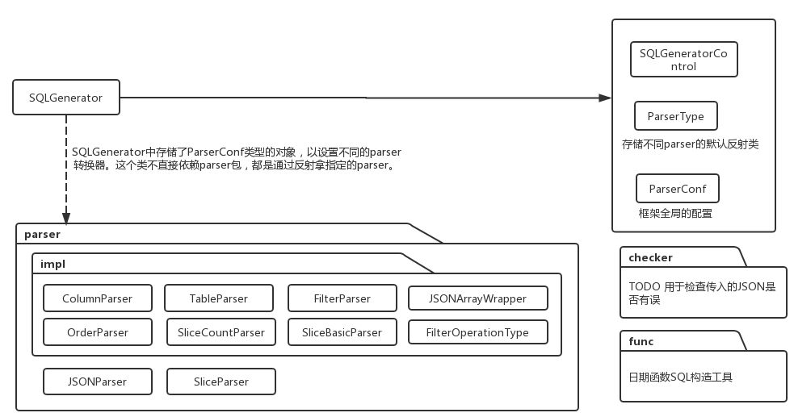

# JSON2SQL connects JSON with SQL.
This is a project designed to connect json with SQL. Welcome to pull it and modify it. I belive we can make it more flexible.

## JSON格式规范
JSON格式:
```json

{
	"database": "dbName",
	"table": "tableName",
	"dimension": [{
		"name": "create_time_day",
		"verbose": "创建时间(天)",
		"expression": "DATE_FORMAT(create_time,'%Y-%m-%d')"
	}],
	"metric": [{
		"name": "user_number",
		"verbose": "用户数",
		"expression": "count(DISTINCT user_code)"
	}],
	"filter": [{
		"name": "create_time_day",
		"verbose": "创建时间(天)",
		"expression": "DATE_FORMAT(create_time,'%Y-%m-%d')",
		"operation": "in",
		"type": 0,
		"option": "['2018-03-22']",
		"optionText": "11,3,4"
	}, {
		"name": "user_number",
		"verbose": "用户数",
		"expression": "count(DISTINCT user_code)",
		"operation": "in",
		"type": 1,
		"option": ["1", "2"],
		"optionText": "11,2"
	}],
	"order": [{
		"name": "create_time_day",
		"verbose": "创建时间(天)",
		"expression": "DATE_FORMAT(create_time,'%Y-%m-%d')",
		"operation": "asc"
	}],
	"limit": "1000",
	"title": "用户创建日期分析",
	"type": "table",
	"type_val": 2
}
```
下面对各字段的详细细节，进行描述：
### dimension/metric
由于dimension/metric并无差异，于是可通过同一个转换器([ColumnParser](./src/main/java/com/github/memorylorry/JSON2SQL/parser/impl/ColumnParser.java))进行转换。如下为详细字段说明：

|字段名 |说明|
|------|---|
|name|英文名(若expression是空串则用该字段)|
|verbose|中文名(暂未用)|
|expression|表达式|

### database/table
构建表名的时候，采用的构造器为[TableParser](./src/main/java/com/github/memorylorry/JSON2SQL/parser/impl/TableParser.java)；若table字段中存在select关键字，则用小括号包括并舍弃database字段。如下为字段描述：

|字段名 |说明|
|------|---|
|database|数据库名|
|table|表名|

### filter
如下为filter的字段说明，采用的构造器为[FilterParser](./src/main/java/com/github/memorylorry/JSON2SQL/parser/impl/FilterParser.java)。

|字段名 |说明|
|------|---|
|name|英文名(若expression是空串则用该字段)|
|verbose|中文名(暂未用)|
|expression|表达式|
|operation|操作符(>&#124;<&#124;like&#124;in等)|
|type|类型： 0-维度过滤 1-指标过滤|
|option|筛选值(数组或字符串)|
|optionText|筛选值(字符串)|

- operation存储了操作符，可以是[FilterOperationType](./src/main/java/com/github/memorylorry/JSON2SQL/parser/impl/FilterOperationType.java)中的枚举类型，有`in|not in|>|like|not like|lg_date_fun`等类型，根据不同的操作符，对option和optionText的操作方式不同。
- type存储filter字段是维度还是指标，其控维度放在where中过滤，指标放入having中过滤。
- option是必填项，数组默认填`[]`，字符串默认填`''`;
- optionText是必填项，默认填`''`;

其中option、optionText共同构成了筛选值，它们取并集。

### order
如下为order的字段说明，采用的构造器为[OrderParser](./src/main/java/com/github/memorylorry/JSON2SQL/parser/impl/OrderParser.java)。

|字段名 |说明|
|------|---|
|name|英文名(若expression是空串则用该字段)|
|verbose|中文名(暂未用)|
|expression|表达式|
|operation|操作符(asc&#124;desc)|

### limit

这个字段会在[SliceBasicParser](./src/main/java/com/github/memorylorry/JSON2SQL/parser/impl/SliceBasicParser.java)进行使用。

### type_val

这个字段控制了SQL在转化过程中，维度是否存在、维度是否应该聚合；详情见[SliceBasicParser](./src/main/java/com/github/memorylorry/JSON2SQL/SQLGeneratorControl.java)进行使用：

|值|说明|
|------|---|
|0|DIMENSIN_NOT_EXSIT(无维度)|
|2|DIMENSIN_NOT_CONCAT(维度不合并)|
|3|DIMENSIN_CONCAT(维度合并)|

## 设计思路
本框架根据上一节的规范json，设计了独立的转化器(parser)。如下表所述，即为各字段用的转换器。

|JSON中的字段 |用的parser(转sql)|
|------|---|
|dimension、metric|ColumnParser|
|table|TableParser|
|filter|FilterParser|
|order|OrderParser|

你或许观察到limit、type、type_val字段没有对应的转换器，其实它都直接放入了SliceParser、CountParser。
## 包结构
如下图，图中的SQLGenerator不直接依赖任何parser,而是通过对象中的ParserConf取出对应column/table/filter/order的parser。于是开发者能够结合各自的需要，自定义其个性化的parser。


## 使用方法
```
// 构造JSON2SQL构造器
SQLGenerator sqlGenerator = SQLGenerator.build();
// 待转JSON
String jsonStr = "{\"database\":\"dbName\",\"table\":\"tableName\",\"dimension\":[{\"name\":\"create_time_day\",\"verbose\":\"创建时间(天)\",\"expression\":\"DATE_FORMAT(create_time,'%Y-%m-%d')\",\"type\":\"1\"}],\"metric\":[{\"name\":\"user_number\",\"verbose\":\"用户数\",\"expression\":\"count(DISTINCT user_code)\"}],\"filter\":[{\"name\":\"create_time_day\",\"verbose\":\"创建时间(天)\",\"expression\":\"DATE_FORMAT(create_time,'%Y-%m-%d')\",\"operation\":\"in\",\"type\":0,\"option\":\"['2018-03-22']\",\"optionText\":\"11,3,4\"},{\"name\":\"user_number\",\"verbose\":\"用户数\",\"expression\":\"count(DISTINCT user_code)\",\"operation\":\"in\",\"type\":1,\"option\":[\"1\",\"2\"],\"optionText\":\"11,2\"}],\"order\":[{\"name\":\"create_time_day\",\"verbose\":\"创建时间(天)\",\"expression\":\"DATE_FORMAT(create_time,'%Y-%m-%d')\",\"operation\":\"asc\"}],\"limit\":\"1000\",\"title\":\"用户创建日期分析\",\"type\":\"table\",\"type_val\":2}";
// 通过默认的sliceParser进行转化sql，并打印
System.out.println(sqlGenerator.parse(jsonStr));
// 更换构造器中的parser配置为count类型的parser
sqlGenerator.setParserConf(SQLGenerator.SLICE_TYPE.COUNT);
// 转换json,并打印初SQL
System.out.println(sqlGenerator.parse(jsonStr));
```

## TODO
- 全局的属性使用Map<String,Object>装，取用时可指定默认值。
- 对JSONObject做包装，取出的时候可指定默认值。
- 对LgDateFunction增加数据库类型，以控制产生的SQL方言。
- 增加checker包，用于检查json是否符合要求。